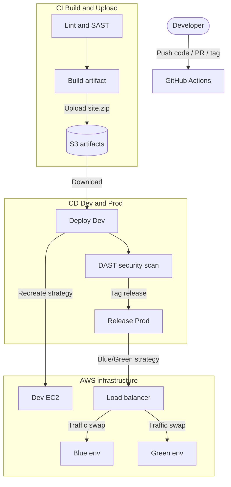

#  Ultimate Portfolio README – Secure Blue/Green CI/CD on AWS with GitHub Actions

- Immutable artifact-based deployments  
- Blue/Green zero-downtime releases on AWS  
- GitOps-driven infrastructure with Terraform  
- Defense-in-depth security (SAST + DAST)  

---

## 📁 Repository Layout

```text
.
├── .github/workflows/        # GitHub Actions pipelines
│   ├── ci.yml                # CI: Lint + SAST + Build & Upload
│   ├── cd-dev.yml            # CD: Deploy to Dev + DAST
│   ├── manage-infra.yml      # Terraform GitOps (plan/apply/destroy + secret sync)
│   └── release.yml           # Production Blue/Green release
├── docs/
│   └── README.md             # (Optional) extra documentation
├── infra/terraform/          # Infrastructure as Code
│   ├── global/               # S3 state + artifacts bucket
│   ├── dev/                  # Dev EC2 + SGs
│   └── prod/                 # ALB + Target Groups + Blue/Green EC2
├── site/                     # Static website source
│   └── index.html
├── site.zip                  # Built artifact (for local testing/demo)
├── keycicd / keycicd.pub     # Example SSH key pair (local only, not committed in real life)
└── README.md                 # You are reading this
````

---

##  Key Architectural Decisions

### CI/CD Pipeline Flow


---

### 1. Immutable Artifacts

* Application code is **zipped and stored in S3**:
  `s3://<ARTIFACTS_BUCKET>/builds/<COMMIT_SHA>.zip`
* Deployments **never** pull from Git directly. They always:

  1. Download the ZIP for a specific commit
  2. Extract it on the target server
* **Why?**

  * Eliminates “it works on my machine / tag changed / dependency drift” issues
  * You can always redeploy a past version by reusing the same artifact

### 2. Stateless Compute: “Cattle, Not Pets”

* EC2 instances are treated as **disposable**:

  * No manual changes on the box
  * No unique snowflake servers
* All configuration is injected via **`user_data`** at boot:

  * Installs Nginx and dependencies
  * Sets ownership and permissions on the web root
* **Benefit:** Any instance can be terminated and recreated without data loss or reconfiguration.

### 3. GitOps for Infrastructure

* Terraform lives in `infra/terraform/*`
* **`manage-infra.yml`** GitHub Actions workflow:

  * Runs `terraform plan/apply/destroy` per environment (`dev`, `prod`, `global`)
  * After `apply`, parses **Terraform outputs** (JSON)
  * Uses the GitHub CLI (`gh`) to **synchronize outputs into GitHub Secrets**:

    * EC2 IPs (Dev / Blue / Green)
    * ALB Listener ARN
    * Target Group ARNs
    * Artifacts bucket
* **Outcome:** No manual copy-paste of ARNs/IPs into secrets → fewer mistakes, no configuration drift.

---

##  Deployment Strategies


### 1. Development – “Recreate” Strategy

**Architecture**

* Single EC2 instance (micro/spot-friendly)
* Nginx serving static content from `/usr/share/nginx/html`

**Mechanism**

Workflow: **`cd-dev.yml`**

1. GitHub Actions downloads the artifact:
   `s3://ARTIFACTS_BUCKET/builds/<COMMIT_SHA>.zip`
2. SSH into Dev EC2 (`EC2_HOST_DEV`)
3. **Recreate pattern**:

   * `rm -rf /usr/share/nginx/html/*`
   * `unzip /tmp/site.zip -d /usr/share/nginx/html`
4. Reloads or restarts Nginx

**Concurrency**

* Conceptually designed to use GitHub concurrency groups so that:

  * Multiple pushes to `main` are **queued**
  * Each deployment is atomic and uses a single artifact

**Trade-off**

*  Very low cost (one small instance)
*  Simple to reason about
*  Short downtime (~1–2 seconds) while files are replaced → fine for Dev / QA

---

### 2. Production – Blue/Green Strategy

**Architecture**

* One **Application Load Balancer (ALB)**
* Two Target Groups:

  * **Blue** → EC2 instance (prod blue)
  * **Green** → EC2 instance (prod green)
* Only one Target Group is “live” at a time.

**Mechanism** – `release.yml`

1. **Detect**

   * Query AWS:
     `describe-listeners` → Which Target Group is currently serving traffic?
   * If `PROD_TG_BLUE_ARN` is live → deploy to **Green**, else deploy to **Blue**.

2. **Deploy (Idle Env)**

   * SCP the artifact to the target EC2 (Blue or Green IP)
   * SSH in and:

     * Install Nginx if missing (self-healing)
     * Wipe the web root
     * Unzip the new artifact
     * Write `version.txt` with the tag name (e.g., `v1.0.0`)

3. **Local Health Check**

   * From inside the EC2, `curl http://localhost/version.txt`
   * This checks the app **behind** the security group (which only allows ALB traffic from outside).

4. **Swap Traffic**

   * If health check passes:

     * `modify-listener` → Set `TargetGroupArn` to the *new* target group.
   * Blue ↔ Green swap is instantaneous.

**Trade-offs**

*  Zero-downtime deployments
*  Instant rollback (flip back to previous Target Group)
*  Higher cost (2× prod EC2 instances + ALB)

---

##  Pipeline Workflows

### 1. Continuous Integration – `ci.yml`

**Triggers**

* Push to `main`
* Pull Requests targeting `main`
* Tags `v*`
* Manual `workflow_dispatch`

**Jobs**

1. **`quality-checks`**

   * **HTML Linting**

     * Node.js 20 + `html-validate`
     * Custom `.htmlvalidate.json` to keep rules realistic for static sites
   * **SAST**

     * `aquasecurity/trivy-action` with:

       * `scan-type: fs`
       * `severity: CRITICAL,HIGH`
       * Fails the job on serious issues

2. **`build-and-upload`**

   * Zips the `/site` folder into `site.zip`
   * Configures AWS credentials
   * Uploads to: `s3://ARTIFACTS_BUCKET/builds/<COMMIT_SHA>.zip`

**Outcome:**
Only **tested and scanned** artifacts make it to S3.

---

### 2. Continuous Deployment – Dev – `cd-dev.yml`

**Triggers**

* `workflow_run` on successful completion of **`CI (Build & Upload)`**
* Manual `workflow_dispatch`

**Jobs**

* **Configure AWS**
* **Download Artifact** from S3 using:

  * `github.event.workflow_run.head_sha` (when triggered from CI)
  * `github.sha` (for manual dispatch)
* **SSH Setup** using `SSH_PRIVATE_KEY_DEV_B64`
* **Deploy to Dev EC2**

  * Upload `site.zip`
  * Wipe & redeploy into `/usr/share/nginx/html`
  * Reload/restart Nginx
* **Validation**

  1. Functional Health Check (external)

     * `curl http://EC2_HOST_DEV/version.txt`
  2. **DAST Scan** with OWASP ZAP:

     * `zaproxy/action-baseline`
     * Targets `http://EC2_HOST_DEV`
     * Runs passive rules + alpha rules (`-a`)

---

### 3. Release – Production – `release.yml`

**Trigger**

* Push of a tag **`v*`** (e.g., `v1.0.0`)

**Jobs**

* **Build Artifact**

  * Rebuilds `site.zip` (or could be switched to use S3 artifact-only)
* **Configure AWS & SSH**
* **Detect Active Color**

  * Use `PROD_LISTENER_ARN` to determine if Blue or Green is live
* **Deploy to Idle Color**

  * Self-healing Nginx install
  * Unzip new content
  * Write `version.txt` based on tag
* **Internal Health Check**

  * `curl http://localhost/version.txt` via SSH
* **Swap Traffic**

  * Update ALB listener to point to `NEW_TG_ARN`

---

### 4. Infrastructure Management – `manage-infra.yml`

**Trigger**

* Manual `workflow_dispatch`

**Inputs**

* `environment`: `dev` | `prod` | `global`
* `terraform_action`: `plan` | `apply` | `destroy`

**Process**

* Sets working directory: `infra/terraform/${environment}`
* Runs:

  * `terraform init`
  * `terraform validate`
  * `terraform plan` / `apply -auto-approve` / `destroy -auto-approve`

**Secret Sync**

* **Dev**

  * Reads `terraform output -json`
  * Extracts `dev_public_ip`
  * Updates GitHub secret: `EC2_HOST_DEV`
* **Prod**

  * Extracts:

    * `prod_ip_blue`
    * `prod_ip_green`
    * `prod_listener_arn`
    * `prod_tg_blue_arn`
    * `prod_tg_green_arn`
  * Updates secrets:

    * `PROD_IP_BLUE`
    * `PROD_IP_GREEN`
    * `PROD_LISTENER_ARN`
    * `PROD_TG_BLUE_ARN`
    * `PROD_TG_GREEN_ARN`
* **Global**

  * Extracts `artifacts_bucket_name`
  * Updates `ARTIFACTS_BUCKET` secret

---

##  Infrastructure as Code (Terraform)

Terraform is split per responsibility:

* `infra/terraform/global/`

  * S3 remote state bucket
  * S3 artifacts bucket
* `infra/terraform/dev/`

  * Dev EC2 instance
  * Security Groups
  * User Data for Nginx + app bootstrap
* `infra/terraform/prod/`

  * ALB + Listener
  * Blue & Green Target Groups
  * Blue & Green EC2 instances
  * Security Groups (Prod EC2 only accepts ALB traffic)

### Self-Healing User Data

User Data scripts on EC2s:

* Wait for package manager locks to clear (common cloud-init race condition)
* Install Nginx if missing
* Reapply permissions to `/usr/share/nginx/html`
* Ensure Nginx is enabled and started

---

##  Security & Compliance

Security is embedded across the stack:

| Layer    | Implementation                                       | Tool / Mechanism              |
| -------- | ---------------------------------------------------- | ----------------------------- |
| Code     | Static scan for secrets + vulnerabilities            | Trivy (SAST, filesystem scan) |
| Runtime  | Dynamic scan of running Dev app                      | OWASP ZAP baseline action     |
| Network  | Strict Security Groups                               | Prod EC2 HTTP only from ALB   |
| Server   | Hardened Nginx config + headers (via IaC & userdata) | Nginx + Terraform             |
| Identity | No long-lived AWS keys on laptops                    | GitHub Secrets + IAM Users    |

---

##  Setup Guide

### Prerequisites

* AWS Account
* GitHub Account + PAT (Personal Access Token)
* Terraform CLI
* AWS CLI
* SSH key pair:

  ```bash
  ssh-keygen -t ed25519
  ```

### 1. Bootstrap Global Terraform (Fixing the “Chicken and Egg” Problem)

Remote state lives in S3, but Terraform needs the bucket to exist first.

1. **Go to** `infra/terraform/global`
2. **Comment out** the `backend "s3"` block in `main.tf`
3. Run:

   ```bash
   terraform init
   terraform apply
   ```

   → Creates the state/artifacts bucket.
4. **Uncomment** the backend block and migrate:

   ```bash
   terraform init -migrate-state
   ```

### 2. Configure GitHub Secrets & Variables

Go to:
**GitHub → Repo → Settings → Secrets and variables → Actions**

#### Required Secrets

| Name                       | Purpose                                       | How to Get It                                               |
| -------------------------- | --------------------------------------------- | ----------------------------------------------------------- |
| `AWS_ACCESS_KEY_ID`        | IAM access key for CI/CD                      | Create IAM user with programmatic access                    |
| `AWS_SECRET_ACCESS_KEY`    | Secret key for the same IAM user              | Shown once upon key creation                                |
| `SSH_PRIVATE_KEY_DEV_B64`  | Base64 of private SSH key for Dev EC2         | `cat id_ed25519_dev \| base64 -w0`                          |
| `SSH_PRIVATE_KEY_PROD_B64` | Base64 of private SSH key for Prod EC2s       | `cat id_ed25519_prod \| base64 -w0`                         |
| `SSH_PUBLIC_KEY`           | Public key injected by Terraform into EC2     | `cat id_ed25519_dev.pub` (and/or prod)                      |
| `PA_TOKEN`                 | GitHub PAT for managing repo secrets via `gh` | GitHub → Developer settings → Tokens (classic/fine-grained) |

Infrastructure-driven secrets (these will later be **overwritten by `manage-infra.yml`** after Terraform apply):

| Name                | Purpose                           | Initially Set As... (Placeholder)            |
| ------------------- | --------------------------------- | -------------------------------------------- |
| `ARTIFACTS_BUCKET`  | S3 bucket where builds are stored | `"placeholder-bucket"`                       |
| `EC2_HOST_DEV`      | Dev instance public IP            | `"0.0.0.0"`                                  |
| `PROD_IP_BLUE`      | Blue EC2 IP                       | `"0.0.0.0"`                                  |
| `PROD_IP_GREEN`     | Green EC2 IP                      | `"0.0.0.0"`                                  |
| `PROD_LISTENER_ARN` | ALB Listener ARN                  | `"arn:aws:elasticloadbalancing:..."` (dummy) |
| `PROD_TG_BLUE_ARN`  | Blue Target Group ARN             | placeholder string                           |
| `PROD_TG_GREEN_ARN` | Green Target Group ARN            | placeholder string                           |

> After you run **`Manage Infrastructure (Universal)`** with `terraform_action=apply`, the workflow will query `terraform output` and **replace these secrets with real values**.

#### Recommended Repository Variables

Under **“Variables”** (not secrets), you can set:

| Name         | Purpose            | Example        |
| ------------ | ------------------ | -------------- |
| `AWS_REGION` | Default AWS region | `eu-central-1` |

---

##  Operational Runbook

### How to Deploy a Feature to Dev

1. Commit your changes to `main`:

   ```bash
   git add .
   git commit -m "feat: new awesome feature"
   git push origin main
   ```
2. **Result:**

   * `CI (Build & Upload)` runs → Lint + SAST → upload artifact to S3
   * `CD Dev (Deploy)` runs on successful CI
   * Dev EC2 is updated
   * OWASP ZAP DAST scan runs against Dev

---

### How to Release to Production

1. Tag the commit:

   ```bash
   git tag v1.0.0
   git push origin v1.0.0
   ```
2. **Result:**

   * `Release Prod (Blue/Green)` workflow triggers
   * Detects active color (Blue or Green)
   * Deploys to idle environment
   * Runs internal health check
   * Swaps ALB traffic to new environment only on success

Rollback is simply **re-running the release** with the previous tag or flipping the Listener back to the old Target Group.

---

### How to Update Infrastructure (e.g., change EC2 type)

1. Edit the appropriate Terraform module (e.g., `infra/terraform/prod/main.tf`).
2. Commit & push to `main`.
3. Go to **GitHub → Actions → Manage Infrastructure (Universal)**.
4. Run workflow with:

   * `environment`: `dev` or `prod`
   * `terraform_action`: `plan` (preview) or `apply` (execute)
5. **After `apply`:**

   * Workflow updates GitHub Secrets with new IPs/ARNs
   * Next deployment automatically uses new infrastructure

---

##  License

This project is licensed under the **MIT License** – see the `LICENSE` file for details.


